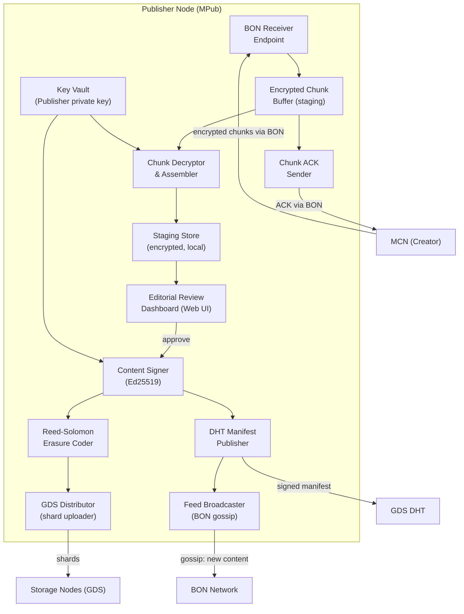
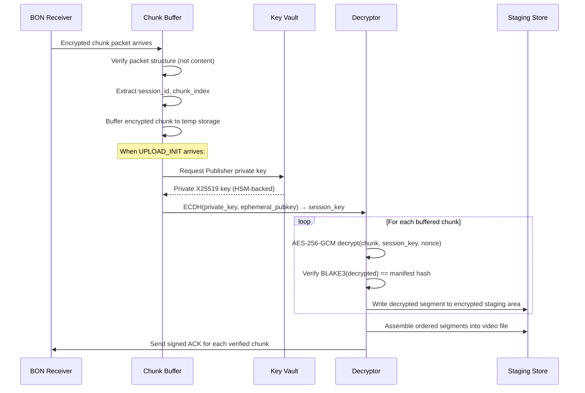
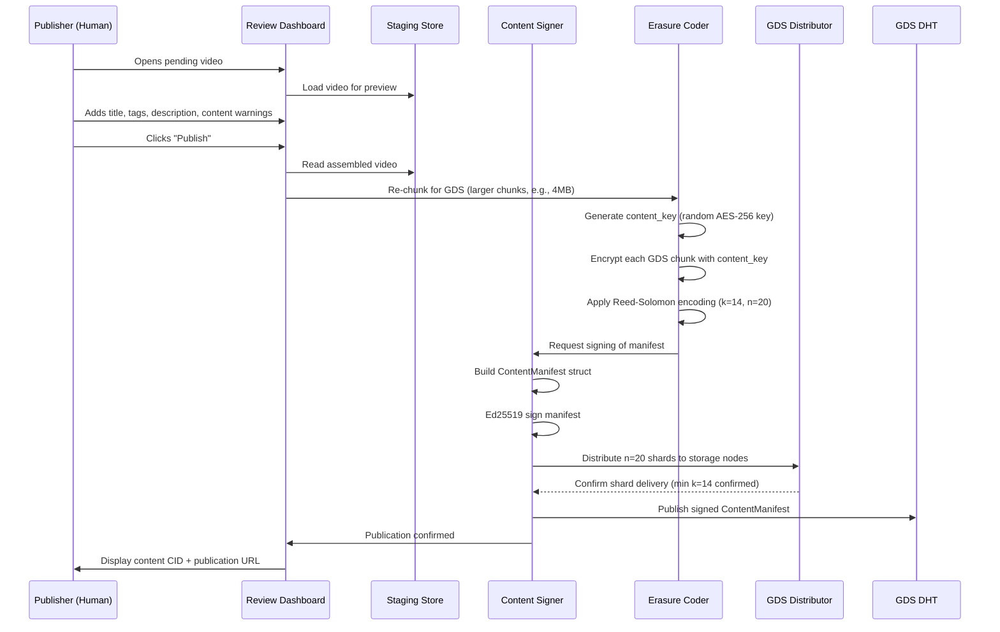

# GBN-ARCH-002 — Media Publishing: Architecture

**Document ID:** GBN-ARCH-002  
**Version:** 0.1 (Draft)  
**Status:** In Review  
**Last Updated:** 2026-04-07  
**Requirements:** [GBN-REQ-002](../requirements/GBN-REQ-002-Media-Publishing.md)  
**Parent Architecture:** [GBN-ARCH-000](GBN-ARCH-000-System-Architecture.md)

---

## 1. Overview

The Media Publishing architecture is designed as a **secure, auditable editorial workstation** combined with a **content distribution engine**. It is the single point where:
- Creator anonymity ends (the Publisher has the decrypted video, but NOT the Creator's identity)
- Publisher accountability begins (Publisher signs everything they publish with their long-term key)
- Permanent content distribution is initiated (content committed to GDS is permanent unless explicitly revoked)

The Publisher node runs on dedicated infrastructure — typically a server in a censor-resistant jurisdiction — and requires careful key management, in-staging encryption, and a robust GDS distribution pipeline.

---

## 2. Component Diagram



---

## 3. Data Flow

### 3.1 Chunk Reception & Decryption



### 3.2 Editorial Review to GDS Publication



---

## 4. Protocol Specification

### 4.1 Publisher Endpoint Advertisement

Publishers advertise their BON receiving endpoint via the DHT:

```
PublisherAnnouncement {
    publisher_id:      Ed25519PublicKey
    bon_addresses:     [NodeAddressRecord]    // one per supported transport
    x25519_pubkey:     X25519PublicKey        // for ECDH key agreement
    timestamp:         u64
    signature:         Ed25519Signature       // signs all fields above
    ttl_seconds:       u32  (default: 3600)   // re-announce before expiry
}
```

### 4.2 Content Manifest (Full Definition)

```
ContentManifest {
    // Identity
    content_id:             BLAKE3(video_plaintext)
    publisher_id:           Ed25519PublicKey
    publication_timestamp:  u64

    // Metadata
    title:                  string (max 256 chars)
    description:            string (max 4096 chars)
    tags:                   [string]
    duration_secs:          u32
    thumbnail_cid:          BLAKE3Hash
    content_warnings:       [string]     // e.g., ["adult", "violence"]

    // Storage
    storage: {
        rs_k:               u8           // default: 14
        rs_n:               u8           // default: 20
        chunk_size_bytes:   u32          // default: 4MB
        total_chunks:       u32
        shard_cids:         [BLAKE3Hash] // n shard content IDs
        content_key_enc:    bytes        // AES key, encrypted with Publisher's X25519 pubkey
    }

    // Signing
    signature:              Ed25519Signature   // signs all fields above
}
```

### 4.3 Feed Entry

```
FeedEntry {
    publisher_id:     Ed25519PublicKey
    sequence:         u64              // monotonically increasing per Publisher
    content_id:       BLAKE3Hash
    manifest_cid:     BLAKE3Hash       // CID of the ContentManifest
    published_ts:     u64
    channel:          string?          // optional channel name
    signature:        Ed25519Signature // signs: publisher_id + sequence + content_id + ts
}
```

---

## 5. Technology Choices

| Component | Technology | Rationale |
|---|---|---|
| **Key Vault** | libsodium + optional HSM (via PKCS#11) | Defense-in-depth; HSM optional but supported |
| **Erasure Coding** | `reed-solomon-erasure` (Rust crate) | Well-tested; supports configurable k/n |
| **Chunk Buffering** | Local SQLite + encrypted file store | Simple; auditable; no external dependencies |
| **Staging Encryption** | AES-256-GCM with Publisher-controlled local key | Key held in secure memory; never on disk plaintext |
| **Review Dashboard** | Local HTTPS web app (Axum/Rust backend, React frontend) | Runs locally; no external SaaS dependency |
| **DHT Publishing** | Custom Kademlia client over BON | Consistent with GBN DHT layer |
| **GDS Distribution** | Async parallel shard upload (Tokio) | Upload to 20 nodes concurrently |
| **Signing** | `ed25519-dalek` (Rust) | Zero-dependency; constant-time operations |

---

## 6. Deployment Model

```
Publisher Server (VPS or bare metal, in censor-resistant jurisdiction)
  ├── MPub Daemon (Rust)
  │   ├── BON Receiver (listens on BON overlay address)
  │   ├── Chunk Buffer (encrypted SQLite + file store)
  │   ├── Decryption Engine
  │   ├── Erasure Coder
  │   └── GDS Distributor
  ├── Key Vault (libsodium, optional HSM via PKCS#11)
  ├── Review Dashboard (local HTTPS, bind: 127.0.0.1:8443)
  └── BON Node (relay capable, always-on)

Minimum Server Spec:
  - 4 vCPU, 16GB RAM, 2TB NVMe SSD
  - 100Mbps symmetric internet (for GDS distribution)
  - UPS or cloud provider with 99.9% uptime SLA
```

### 6.1 Dispersed Edge Ingestion (GPA Mitigation)

```
Publisher Master Node (Reassembly & Key Vault)
  ├── Edge Receiver Node 1 (Hosted in EU)
  ├── Edge Receiver Node 2 (Hosted in NA)
  └── Edge Receiver Node 3 (Hosted in APAC)
      └── All edge nodes announce to the DHT using the Publisher's identity
      └── MCN chunks are randomly distributed across these global edges
      └── Edge nodes privately sync encrypted chunks to the Master Node via VPN or internal overlay
```
Because the MCN splits its exit paths across multiple globally dispersed Edge Receivers, a Global Passive Adversary (GPA) cannot easily correlate a massive volume spike at a single target IP. The traffic is smeared across multiple jurisdictions and timelines.

---

## 7. Security Architecture

### 7.1 Key Storage

```
Publisher Key Hierarchy:
  Master Ed25519 seed (256-bit)
    → Ed25519 signing keypair (long-term)
    → X25519 encryption keypair (derived or separate)

Storage options (in order of security):
  1. Hardware HSM (Thales, Yubico HSM2) — highest security
  2. Software HSM (SoftHSMv2) — good for testing
  3. libsodium encrypted keyfile (AES-256-GCM, password-derived key) — minimum viable
```

### 7.2 Staging Area Security

- All received chunks stored encrypted with a local "staging key" (AES-256-GCM)
- Staging key is derived from Publisher's master key + a local random salt
- Plaintext video never exists on disk; it passes through memory during review preview
- Staging eviction policy: chunks auto-deleted 72 hours after delivery if not approved or rejected

---

## 8. Scalability & Performance

| Metric | Target | Mechanism |
|---|---|---|
| Concurrent upload sessions | ≥ 10 simultaneous Creators | Async I/O; per-session isolated buffers |
| Reassembly speed | 500MB in < 60s | Streaming AES-GCM decryption; no full-file buffering |
| GDS distribution | 20 shards in < 5 minutes | Async parallel uploads (Tokio); retry on failure |
| Dashboard throughput | Single operator workflow | Not a scalability concern; local UI |

---

## 9. Dependencies

| Component | Depends On |
|---|---|
| **MPub** | **BON** — all incoming chunk traffic and outgoing gossip/ack |
| **MPub** | **GDS** — shard distribution to storage nodes |
| **MPub** | **DHT** (via BON) — manifest publication and Publisher announcement |
| **MPub** | Publisher's long-term keypair — generated offline, stored in Key Vault |
