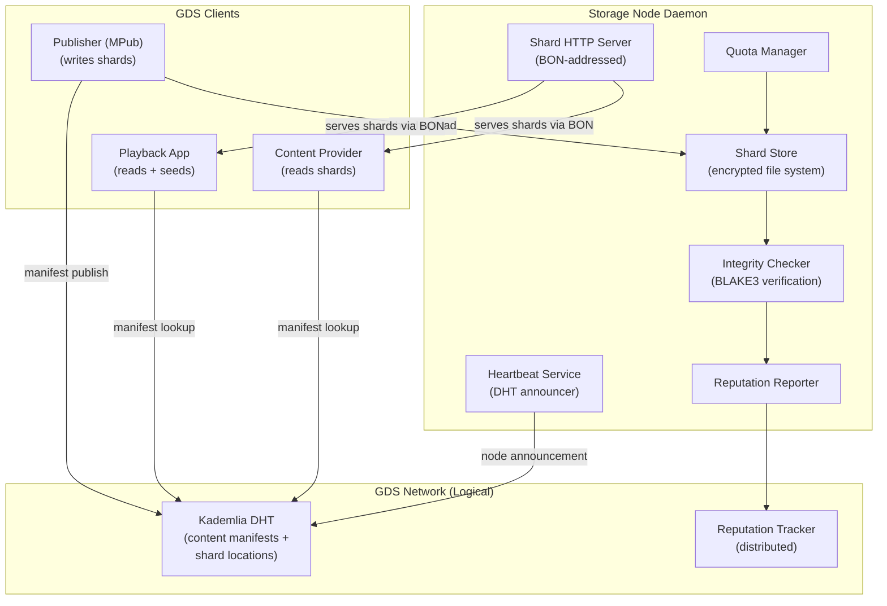
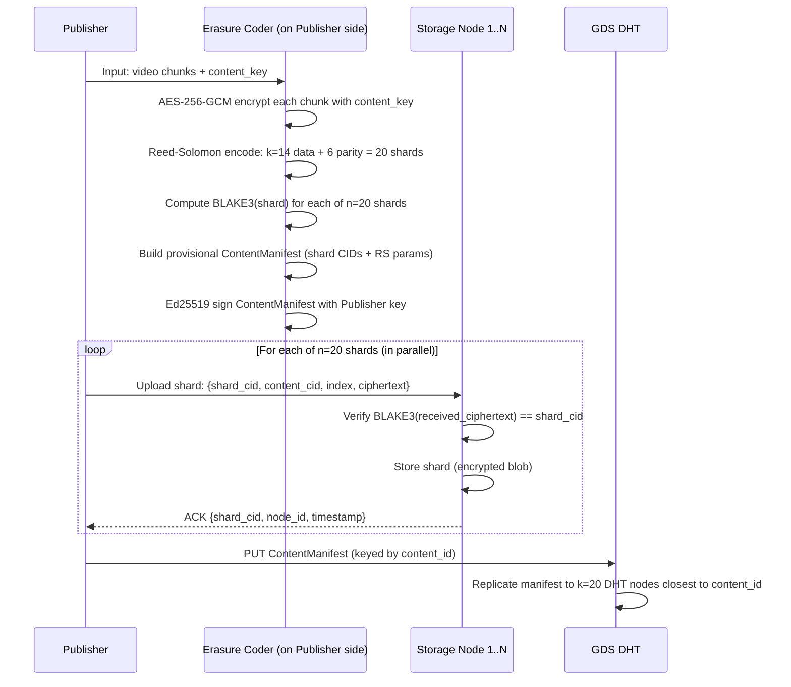
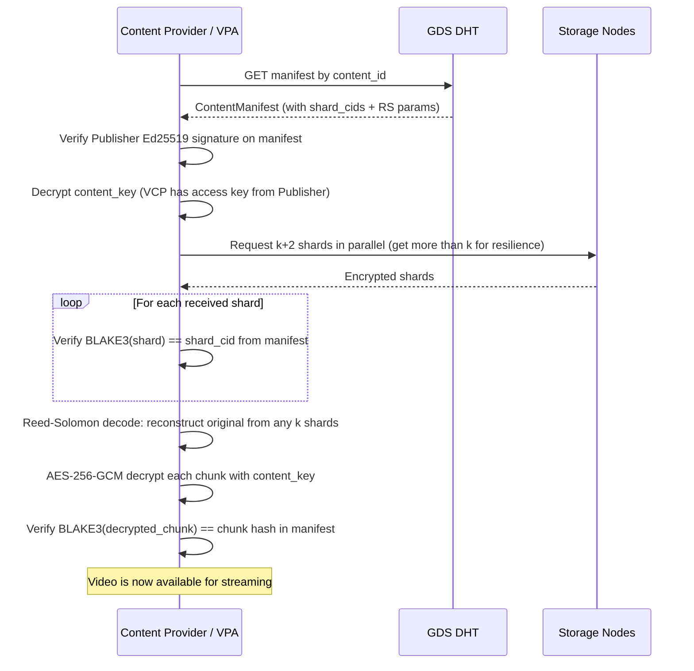
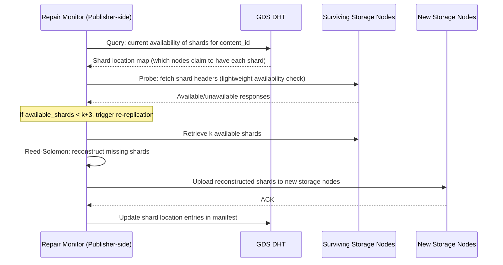

# GBN-ARCH-003 — Globally Distributed Storage: Architecture

**Document ID:** GBN-ARCH-003  
**Version:** 0.1 (Draft)  
**Status:** In Review  
**Last Updated:** 2026-04-07  
**Requirements:** [GBN-REQ-003](../requirements/GBN-REQ-003-Global-Distributed-Storage.md)  
**Parent Architecture:** [GBN-ARCH-000](GBN-ARCH-000-System-Architecture.md)

---

## 1. Overview

The Globally Distributed Storage (GDS) architecture is modeled on a synthesis of **BitTorrent DHT** (for decentralized content discovery), **IPFS content addressing** (for hash-based shard identity), and **proprietary erasure coding** (for efficient redundancy without full replication).

The fundamental storage guarantee: **any k shards from n placed shards can reconstruct the original content**. Storage nodes are **blind** — they store encrypted shards and have no ability to read, decode, or censor content.

---

## 2. Component Diagram



---

## 3. Data Flow

### 3.1 Shard Write (Publisher → GDS)



### 3.2 Shard Read (Consumer → GDS)



### 3.3 Proactive Re-Replication



---

## 4. Protocol Specification

### 4.1 Shard Upload Protocol

```
1. Publisher → Storage Node: HTTP POST /shard (over BON)
   Body: {
     shard_cid:      BLAKE3Hash (32 bytes hex)
     content_cid:    BLAKE3Hash
     shard_index:    u16
     rs_k:           u8
     rs_n:           u8
     ciphertext:     binary blob
     gcm_nonce:      12 bytes
     gcm_tag:        16 bytes
     publisher_sig:  Ed25519Signature (signs: content_cid + shard_index + shard_cid)
   }

2. Storage Node verifies:
   - BLAKE3(ciphertext) == shard_cid
   - Ed25519 signature valid for known Publisher key
   - Quota available

3. Storage Node → Publisher: HTTP 200 OK
   Body: {
     shard_cid:    BLAKE3Hash
     node_id:      Ed25519PublicKey
     timestamp:    u64
     signature:    Ed25519Signature
   }
```

### 4.2 Shard Retrieval Protocol

```
1. Consumer → Storage Node: HTTP GET /shard/{shard_cid} (over BON)

2. Storage Node:
   - Lookup shard by CID in local store
   - Return 404 if not found
   - Return shard with integrity proof

3. Storage Node → Consumer: HTTP 200 OK
   Body: {
     shard_cid:    BLAKE3Hash
     ciphertext:   binary blob
     gcm_nonce:    12 bytes
     gcm_tag:      16 bytes
   }

4. Consumer verifies:
   - BLAKE3(ciphertext) == shard_cid
   - GCM tag validates (content_key + nonce)
```

### 4.3 Storage Node Heartbeat (to DHT)

```
Every 30 minutes, each storage node PUTs to DHT:
NodeHeartbeat {
    node_id:          Ed25519PublicKey
    bon_addresses:    [NodeAddressRecord]
    quota_total_gb:   u32
    quota_used_gb:    u32
    shard_cids:       [BLAKE3Hash]    // full inventory (or Bloom filter for large stores)
    region:           ISO 3166 country code
    timestamp:        u64
    signature:        Ed25519Signature
}

DHT key: SHA256(node_id)
TTL: 2 hours (node must re-announce before expiry)
```

---

## 5. Technology Choices

| Component | Technology | Rationale |
|---|---|---|
| **Erasure Coding** | `reed-solomon-erasure` Rust crate (Jerasure-compatible) | Battle-tested; configurable k/n |
| **Shard Storage** | Local filesystem (XFS/ext4) + SQLite index | Simple; no database dependencies for fast byte retrieval |
| **DHT** | Custom Kademlia over BON | IPFS-compatible CID format; consistent with BON routing |
| **Shard HTTP Server** | Axum (Rust) | Async; lightweight; BON-integrated |
| **Integrity Verification** | BLAKE3 (rust `blake3` crate) | 3–10x faster than SHA256; SIMD-accelerated |
| **Bloom Filter** | `bloom` Rust crate | Efficient shard inventory advertisement in heartbeats |
| **Node OS target** | Linux (primary), Docker container supported | Most storage nodes are Linux VPS instances |

---

## 6. Deployment Model

```
Storage Node (VPS / NAS / Raspberry Pi)
  ├── GDS Daemon (Rust binary)
  │   ├── Shard Store (filesystem: /var/gbn/shards/{shard_cid[0:2]}/{shard_cid})
  │   ├── SQLite Index (shard_cid → metadata)
  │   ├── Shard HTTP Server (BON-addressed, port configurable)
  │   ├── Heartbeat Service
  │   └── Quota Manager
  └── BON Node (for overlay-addressed access)

Directory structure:
/var/gbn/shards/
  a3/
    a3f7bc...  (encrypted shard blob)
  b1/
    b1e2cc...
  ...
```

### 6.1 Sizing Reference

| Pledge | Content Approx. |
|---|---|
| 100 GB node | ~7 GB effective (14/20 ratio), ~1,750 shards at 4MB |
| 1 TB node | ~70 GB effective, ~17,500 shards |
| 10 TB node | ~700 GB effective, ~175,000 shards |

---

## 7. Security Architecture

| Threat | Mitigation |
|---|---|
| Storage node serves corrupted shard | BLAKE3 per-shard verification; node reputation penalty after failures |
| Node seized by law enforcement | Encrypted shards; no content key on node; k-of-n: seizing one node doesn't compromise content |
| Geographic clustering (all n shards in one country) | Publisher responsible for geographic diversity; DHT node registry includes region labels |
| Unauthorized shard write (forged Publisher) | Ed25519 Publisher signature required and verified before storing |
| DHT poisoning (false shard locations) | Multi-source lookup; BLAKE3 verification at retrieval eliminates poison even if location is wrong |

---

## 8. Scalability & Performance

| Metric | Target | Mechanism |
|---|---|---|
| Shard retrieval latency | < 500ms P50 | BON routing + cached shard paths |
| Storage node RAM usage | < 2GB | SQLite index; filesystem-based shard store |
| DHT lookup for manifest | < 2s | Kademlia O(log N) lookup |
| Re-replication trigger | Within 1 hour of shard loss detection | Heartbeat TTL = 2h; proactive check every 30 min |

---

## 9. Dependencies

| Component | Depends On |
|---|---|
| **GDS Storage Node** | **BON** — for all inter-node communication |
| **GDS Storage Node** | **Publisher** — for shard write authorization (Publisher signature) |
| **GDS DHT** | **BON** — DHT messages are BON-routed |
