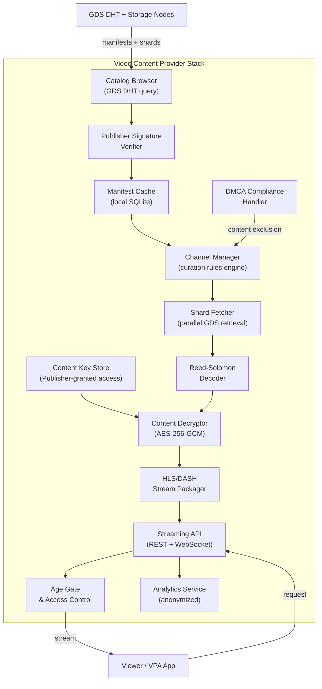
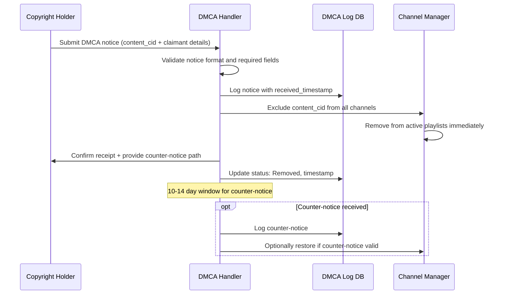

# GBN-ARCH-004 — Video Content Providers: Architecture

**Document ID:** GBN-ARCH-004  
**Version:** 0.1 (Draft)  
**Status:** In Review  
**Last Updated:** 2026-04-07  
**Requirements:** [GBN-REQ-004](../requirements/GBN-REQ-004-Video-Content-Providers.md)  
**Parent Architecture:** [GBN-ARCH-000](GBN-ARCH-000-System-Architecture.md)

---

## 1. Overview

The Video Content Provider (VCP) architecture is designed as a **streaming service integration layer** that sits between the GBN's distributed storage network and conventional viewer-facing applications. A VCP is similar in concept to a streaming platform (Netflix, YouTube), but instead of owning a content upload pipeline and CDN, it **reads from the GBN GDS** and is responsible for its own curation decisions, legal compliance, and access control.

The VCP architecture emphasizes:
- **Publisher trust verification** at every catalog item
- **Legal compliance hooks** (DMCA, age gating) built into the core pipeline
- **Standard streaming protocols** (HLS/DASH) for maximum viewer compatibility
- **Optional BON delivery** for viewers in censored regions

---

## 2. Component Diagram



---

## 3. Data Flow

### 3.1 Content Discovery & Catalog Building

```mermaid
sequenceDiagram
    participant VCP as VCP Catalog Browser
    participant DHT as GDS DHT
    participant Cache as Manifest Cache
    participant Verify as Signature Verifier

    Note over VCP: Periodic (e.g., every 5 minutes) or on-demand
    VCP->>DHT: Query: GET FeedEntries for Publisher_Key
    DHT-->>VCP: [FeedEntry...] (latest publications)

    loop For each new FeedEntry
        VCP->>DHT: GET ContentManifest by manifest_cid
        DHT-->>VCP: ContentManifest

        VCP->>Verify: Verify Ed25519(sig, manifest, publisher_key)
        alt Signature valid
            VCP->>Cache: INSERT manifest into local SQLite
            Note over VCP: Content eligible for channel algorithms
        else Signature invalid
            Note over VCP: Discard; log anomaly
        end
    end
```

### 3.2 Video Streaming Pipeline

```mermaid
sequenceDiagram
    participant V as Viewer Browser/App
    participant API as Streaming API
    participant SM as Shard Fetcher
    participant GDS as GDS Storage Nodes
    participant Dec as Decoder + Decryptor
    participant HLS as HLS Packager

    V->>API: GET /stream/{content_id}/playlist.m3u8
    API->>API: Verify viewer is authorized (age gate, subscription)
    API->>SM: Request HLS segment 0 (video)
    SM->>GDS: Parallel GET shards (k+2 shards for resilience)
    GDS-->>SM: Encrypted shards
    SM->>Dec: Reed-Solomon decode → AES-256-GCM decrypt
    Dec->>HLS: Raw video segment
    HLS->>HLS: Wrap in HLS .ts segment format
    HLS-->>API: HLS segment bytes
    API-->>V: HLS segment (delivered via HTTPS or BON)

    Note over V: Player requests next segment; pipeline repeats
```

### 3.3 DMCA Compliance Flow



---

## 4. Protocol Specification

### 4.1 HLS Playlist Format

```
# VCP-served HLS Master Playlist
# GET /stream/{content_id}/playlist.m3u8

#EXTM3U
#EXT-X-VERSION:3
#EXT-X-STREAM-INF:BANDWIDTH=1500000,RESOLUTION=1280x720
/stream/{content_id}/720p/index.m3u8
#EXT-X-STREAM-INF:BANDWIDTH=4000000,RESOLUTION=1920x1080
/stream/{content_id}/1080p/index.m3u8
```

```
# Segment Playlist
# GET /stream/{content_id}/720p/index.m3u8

#EXTM3U
#EXT-X-TARGETDURATION:6
#EXT-X-KEY:METHOD=NONE   (decryption done server-side; served as clear HLS)
#EXTINF:6.0,
/stream/{content_id}/720p/seg000.ts
#EXTINF:6.0,
/stream/{content_id}/720p/seg001.ts
```

### 4.2 Channel Manifest API

```
GET /channels/{channel_id}/manifest.json

Response:
{
  "channel_id":    "uuid",
  "vcp_name":      "Example News Network",
  "channel_name":  "Breaking News",
  "updated_at":    1700000000,
  "items": [
    {
      "content_id":    "blake3hash",
      "title":         "Video Title",
      "publisher":     "ed25519pubkey_hex",
      "duration_secs": 300,
      "tags":          ["politics", "2026"],
      "published_ts":  1700000000,
      "thumbnail_url": "/thumbs/{content_id}.jpg",
      "stream_url":    "/stream/{content_id}/playlist.m3u8"
    }
  ]
}
```

### 4.3 DMCA Notice Submission API

```
POST /dmca/notice
Content-Type: application/json

{
  "claimant_name":    "Rights Holder Inc.",
  "claimant_email":   "legal@rightsholder.example",
  "content_cid":      "blake3hash",
  "basis":            "17 U.S.C. §512(c)",
  "description":      "This video infringes...",
  "good_faith":       true,
  "signature":        "legal electronic signature"
}

Response: { "notice_id": "uuid", "status": "received", "action_deadline": "ISO8601" }
```

---

## 5. Technology Choices

| Component | Technology | Rationale |
|---|---|---|
| **API Server** | Go (Gin or Echo framework) | Fast JSON APIs; goroutines for concurrency |
| **Shard Fetcher** | Rust library (via GRPC/FFI from Go) | Reuse GBN core library for shard retrieval |
| **HLS Packager** | FFmpeg (server-side) | Standard tool; supports HLS segment generation from raw video |
| **Manifest Cache** | PostgreSQL (hosted) or SQLite (small VCP) | Catalog can be 10M+ items; needs indexed query |
| **DMCA Log** | PostgreSQL | Auditable, queryable log of legal actions |
| **CDN (optional)** | Cloudflare R2 or equivalent | For popular content, cache HLS segments at edge |
| **Age Gate** | JSON Web Token (JWT) + age-verification provider | Standard web auth pattern |
| **Analytics** | ClickHouse (self-hosted) | High-volume time-series analytics; aggregated only |

---

## 6. Deployment Model

```
VCP Infrastructure (standard cloud deployment)
  ├── API Server (Go) — horizontally scalable
  ├── Shard Fetcher Workers (Rust/Go) — pull shards from GDS on demand
  ├── HLS Packager (FFmpeg workers) — transcode and segment on demand
  ├── Manifest Cache DB (PostgreSQL)
  ├── DMCA Compliance DB (PostgreSQL, backed up)
  ├── BON Client (for accessing GDS via overlay in censored regions)
  └── Optional: Edge CDN for popular segments

Minimum viable single-server deployment:
  - 4 vCPU, 16GB RAM, 500GB SSD
  - 1Gbps uplink (for 100+ concurrent viewers)
```

---

## 7. Security Architecture

| Concern | Mitigation |
|---|---|
| Content Key Security | Keys obtained from Publisher via encrypted channel; stored in secret manager (HashiCorp Vault, AWS Secrets Manager) |
| Viewer Privacy | TLS for viewer connections; no long-term IP logging; GDPR-compliant analytics |
| DMCA Liability | Workflow enforces ≤24h removal; log auditable; counter-notice path implemented |
| Forged Manifests | Ed25519 Publisher signature verified before any catalog inclusion |
| VCP Service DDoS | Standard CDN/WAF protection at API layer |

---

## 8. Scalability & Performance

| Metric | Target | Mechanism |
|---|---|---|
| Catalog size | 10M+ videos | PostgreSQL indexed by content_id, publisher_key, tags |
| Concurrent viewers | 100K per deployment | HLS segments cached at CDN; API server stateless |
| Stream start latency | < 5 seconds | Pre-fetch first 2 HLS segments on manifest request |
| DMCA response | < 24 hours | Automated immediate removal on valid notice receipt |

---

## 9. Dependencies

| Component | Depends On |
|---|---|
| **VCP** | **GDS DHT** — for content manifest discovery |
| **VCP** | **GDS Storage Nodes** — for shard retrieval |
| **VCP** | **Publisher** — for content access keys (out-of-band agreement) |
| **VCP** | **BON** — for GDS access in censored network environments |
| **VCP** | **VPA Channel Manifest API** — VPA polls VCP for subscription channels |
