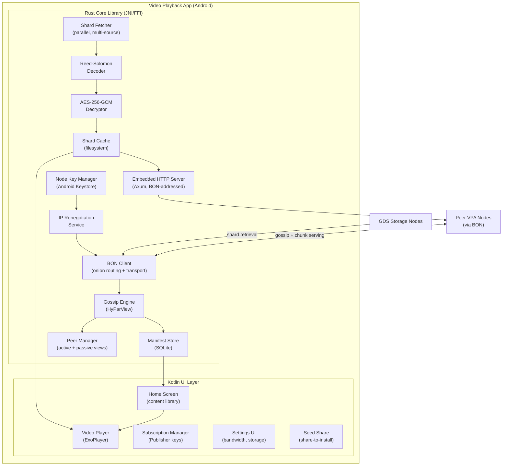
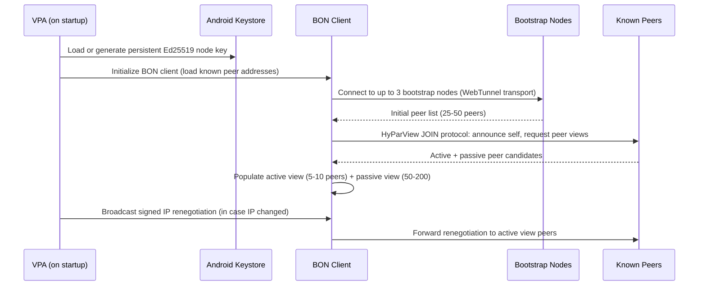
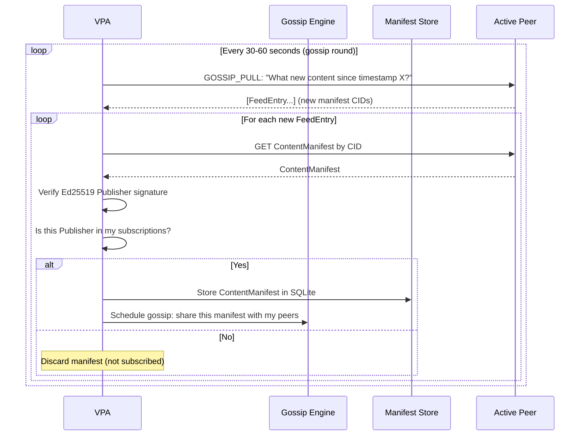
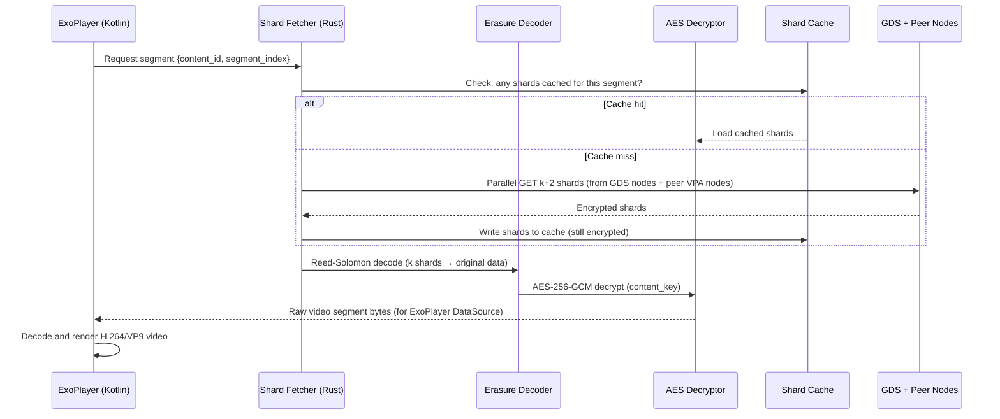
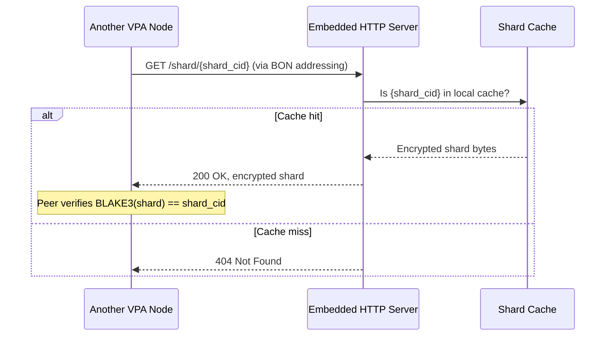

# GBN-ARCH-005 — Video Playback App: Architecture

**Document ID:** GBN-ARCH-005  
**Version:** 0.1 (Draft)  
**Status:** In Review  
**Last Updated:** 2026-04-07  
**Requirements:** [GBN-REQ-005](../requirements/GBN-REQ-005-Video-Playback-App.md)  
**Parent Architecture:** [GBN-ARCH-000](GBN-ARCH-000-System-Architecture.md)

---

## 1. Overview

The Video Playback App (VPA) is simultaneously: a video player, a peer node in the GBN overlay network, a content metadata propagation agent, and a lightweight HTTP content server. This multi-role architecture is necessary to make the broadcast network self-sustaining — every viewer is also a contributor to the network's resilience.

The VPA is designed mobile-first (Android Phase 1) with a shared Rust core that encapsulates all crypto, networking, and protocol logic, exposing a simple API to the Kotlin UI layer.

---

## 2. Component Diagram



---

## 3. Data Flow

### 3.1 App Startup & Peer Discovery



### 3.2 Content Metadata Gossip



### 3.3 Video Streaming from Chunks



### 3.4 Serving Chunks to Peer (Embedded HTTP Server)



---

## 4. Protocol Specifications

### 4.1 HyParView Gossip Protocol

```
Active View: max 5 peers  — maintained with periodic heartbeats
Passive View: max 100 peers — backup list for failover

JOIN (new node):
  Node → Bootstrap: JOIN {node_id, bon_address, timestamp, sig}
  Bootstrap → Node: FORWARD_JOIN {sender_id, new_peer_id}
  Bootstrap → Random Active: FORWARD_JOIN (propagate to TTL hops)

SHUFFLE (peer list exchange, every 60s):
  Node → Random Active Peer: SHUFFLE {my_active_sample[3], my_passive_sample[4]}
  Peer → Node: SHUFFLE_REPLY {peer's active sample[3], passive sample[4]}
  Both: integrate received nodes into passive view

DISCONNECT / NEIGHBOR:
  If active peer disconnects, promote random passive peer to active
  Send NEIGHBOR message to promoted peer
```

### 4.2 IP Renegotiation Message

```
IPRenegotiation {
    node_id:      Ed25519PublicKey
    bon_address:  NodeAddressRecord
    timestamp:    u64
    sequence_no:  u64  // monotonically increasing; reject stale messages
    signature:    Ed25519Signature  // signs: node_id + bon_address + timestamp + seq
}

Propagation: flood to active view; each recipient forwards to their active view (TTL=2)
Receipt: validate signature + sequence_no > last_known_seq for this node_id
```

### 4.3 Share-to-Install Seed Package

```
SeedPackage (encoded as base64 for messaging app transfer) {
    apk_url:          string?            // optional direct download URL
    app_version:      SemVer
    bootstrap_peers:  [NodeAddressRecord]  // 5-10 peer addresses
    publisher_keys:   [Ed25519PublicKey]   // pre-loaded subscriptions
    package_sig:      Ed25519Signature     // signed by sharing node's key
}

Distribution: encoded as QR code, deep link (gbn://seed/{base64}), or file attachment
```

---

## 5. Technology Choices

| Component | Technology | Rationale |
|---|---|---|
| **App Language** | Kotlin (Android) + Rust (JNI core) | Kotlin for UI; Rust for all crypto + protocol logic |
| **Video Player** | ExoPlayer (Android Media3) | Google's reference player; supports custom DataSources |
| **Embedded HTTP Server** | Axum (Rust, compiled to .so via JNI) | Async; ties into BON addressing |
| **Gossip Protocol** | Custom HyParView implementation (Rust) | Proven gossip topology; reliable under churn |
| **Database** | SQLite via SQLx (Rust) | Zero-dependency; proven on Android |
| **Shard Cache** | Android app internal storage (file per shard CID) | Simple; integrity verifiable by filename (CID) |
| **Node Key Storage** | Android Keystore (Ed25519 via API 23+) | Hardware-backed; never leaves secure enclave |
| **Transport Detection** | Network capability probe on BON startup | Select WebTunnel vs. obfs4 based on what works |

---

## 6. Deployment Model

```
Android App (APK)
  ├── Kotlin UI (Activities + Compose)
  │   ├── HomeScreen (content library from ManifestStore)
  │   ├── VideoPlayer (ExoPlayer + custom GBN DataSource)
  │   ├── Settings (bandwidth cap, storage quota, publisher subs)
  │   └── SeedShare (generate seed package for share-to-install)
  │
  └── Rust Core (.so via JNI)
      ├── BON Client
      ├── Gossip Engine (HyParView)
      ├── Manifest Store (SQLite)
      ├── Shard Fetcher + Erasure Decoder
      ├── Content Decryptor
      ├── Embedded HTTP Server (serves to BON peers)
      └── Node Key Manager (Android Keystore bridge)

Background Services (Android Services):
  - GossipService: Foreground service for peer polling (keeps VPA alive in background)
  - EmbeddedServerService: Foreground service for shard serving
  - IPRenegotiationReceiver: Triggered on CONNECTIVITY_CHANGE broadcast

Storage:
  - /data/data/com.gbn.app/databases/gbn.db  (SQLite: manifests, peers, subscriptions)
  - /data/data/com.gbn.app/files/shards/     (encrypted shard blobs)
```

### 6.1 Battery & Data Optimization

| Scenario | Strategy |
|---|---|
| Background gossip | Reduce gossip interval to 5 minutes; suspend if battery < 20% |
| Background relay | WiFi-only mode when battery < 30%; Doze-aware wake locks |
| Cellular shard serving | Disabled by default; user opts in |
| Pre-fetch on WiFi | Optional: pre-fetch shards for subscribed channels on charger + WiFi |

---

## 7. Security Architecture

| Concern | Mitigation |
|---|---|
| Peer network manipulation | Publisher Ed25519 signatures on all manifests; forged content rejected |
| Node key theft | Android Keystore hardware security; key never extracted to JVM layer |
| Revealing viewer's IP to GDS nodes | All shard requests routed via BON; GDS sees BON node address, not device IP |
| Cache poisoning | BLAKE3(shard) == shard_cid verified before caching; corrupted shards rejected |
| App removed from Play Store | APK sideload; F-Droid listing; seed packages distribute APK |
| Replay of stale renegotiations | sequence_no monotonic counter; stale messages rejected |

---

## 8. Scalability & Performance

| Metric | Target | Mechanism |
|---|---|---|
| Peer list convergence | < 5 minutes from cold start | HyParView JOIN + SHUFFLE |
| Content metadata propagation | < 60 seconds for new content to reach 90% of subscribed nodes | Gossip propagation in O(log N) rounds |
| Video start latency | < 5 seconds | Pre-fetch first 2 segments on manifest selection |
| Storage footprint (shards) | Configurable; 1GB–50GB default | LRU eviction policy |
| RAM usage (background) | < 50MB | Rust core with minimal allocations; Kotlin UI suspended |

---

## 9. Dependencies

| Component | Depends On |
|---|---|
| **VPA** | **BON** — all peer communication |
| **VPA** | **GDS Storage Nodes** — shard retrieval |
| **VPA** | **Publisher public keys** — user-supplied subscriptions |
| **VPA** | **VCP** (optionally) — channel manifests |
| **VPA** | Android OS ≥ 8.0 | OS capabilities |
