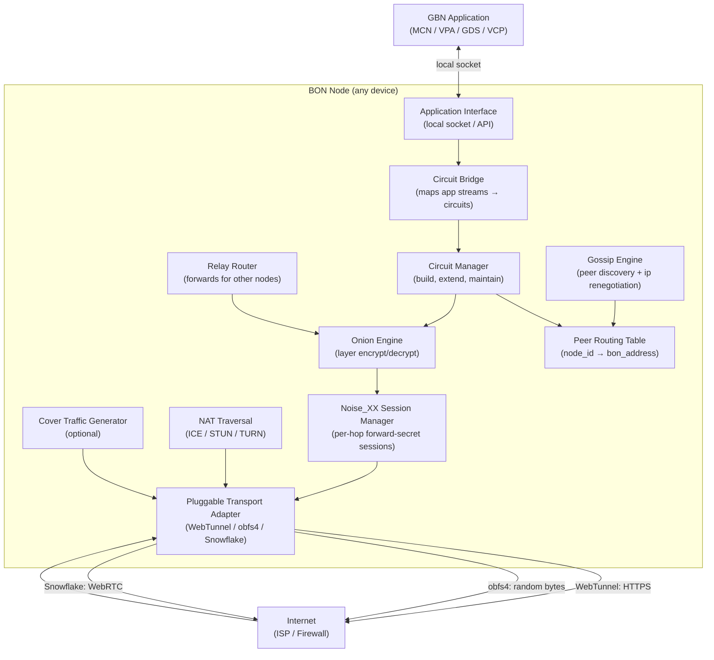
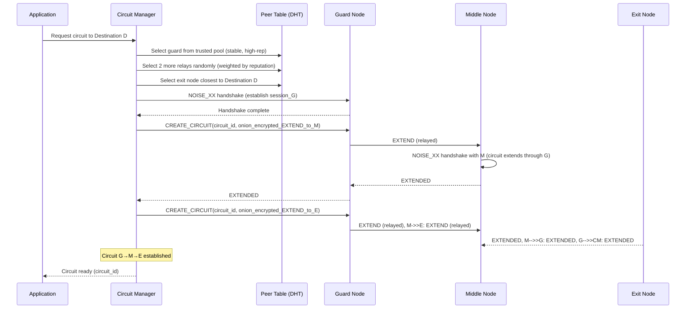
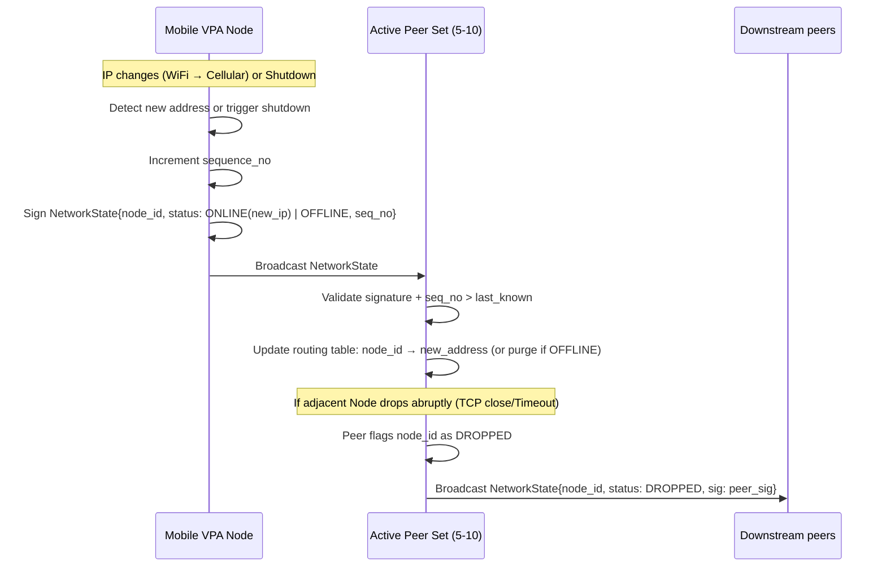

# GBN-ARCH-006 — Broadcast Overlay Network: Architecture

**Document ID:** GBN-ARCH-006  
**Version:** 0.1 (Draft)  
**Status:** In Review  
**Last Updated:** 2026-04-07  
**Requirements:** [GBN-REQ-006](../requirements/GBN-REQ-006-Broadcast-Network.md)  
**Parent Architecture:** [GBN-ARCH-000](GBN-ARCH-000-System-Architecture.md)

---

## 1. Overview

The Broadcast Overlay Network (BON) is the most critical component in the GBN system — every other component depends on it. The BON is a layered system that combines:

1. **Transport Obfuscation** (Pluggable Transports): makes GBN traffic look like HTTPS or WebRTC
2. **Onion Routing**: ensures no single relay node can determine both source and destination
3. **Session Encryption** (Noise Protocol): forward-secret encryption between adjacent nodes
4. **NAT Traversal** (ICE/STUN/TURN): enables mobile and home-network nodes to participate
5. **Gossip-Based Node Discovery**: decentralized, self-healing peer routing table

The design is deliberately modular — each layer can be independently improved as adversarial techniques evolve.

---

## 2. Component Diagram



---

## 3. The Four Layers in Detail

```
┌──────────────────────────────────────────────────────────────────┐
│ LAYER 4: APPLICATION                                             │
│ What the app wants to send/receive                               │
│ (video chunks, manifests, DHT messages)                          │
├──────────────────────────────────────────────────────────────────┤
│ LAYER 3: ONION ROUTING                                           │
│ Multi-hop anonymized delivery                                    │
│ Each hop encrypted with that relay's public key                  │
│ Source: knows Layer 3 envelope for each hop                      │
│ Relay: knows only its upstream and downstream                    │
├──────────────────────────────────────────────────────────────────┤
│ LAYER 2: NOISE SESSION                                           │
│ Forward-secret session encryption between adjacent nodes         │
│ Noise_XX handshake: mutual authentication                        │
│ Derived keys: ChaCha20-Poly1305                                  │
├──────────────────────────────────────────────────────────────────┤
│ LAYER 1: PLUGGABLE TRANSPORT                                     │
│ DPI-resistant disguise for the Layer 2 byte stream               │
│ Options: WebTunnel (HTTPS WebSocket), obfs4, Snowflake (WebRTC)  │
│ An ISP sees this layer only; cannot decode above it              │
└──────────────────────────────────────────────────────────────────┘
```

---

## 4. Data Flow

### 4.1 Circuit Construction



### 4.2 Packet Flow Through Onion Circuit

```
Sending a packet "DATA" from App → Destination via circuit G → M → E:

Step 1: App sends DATA to CM
Step 2: CM builds onion:
  inner  = encrypt(DATA,               key_E)   // exit layer
  middle = encrypt(inner + route_to_E, key_M)   // middle layer
  outer  = encrypt(middle + route_to_M,key_G)   // guard layer

Step 3: CM sends outer over Noise session to Guard G

Step 4: G decrypts outer (with session_G_CM key)
  → sees: [route_to_M, middle_payload]
  → forwards middle_payload to M over session_G_M

Step 5: M decrypts middle (with session_M_G key)
  → sees: [route_to_E, inner_payload]
  → forwards inner_payload to E over session_M_E

Step 6: E decrypts inner (with session_E_M key)
  → sees: DATA + Destination address
  → delivers DATA to Destination D

At no point does any single node see both App origin AND Destination.
```

### 4.3 Noise_XX Handshake

```
Noise_XX pattern (mutual authentication):

→ e                       Initiator sends ephemeral public key
← e, ee, s, es            Responder sends ephemeral + static; key agreement
→ s, se                   Initiator sends static key; key agreement

Result: Shared key derived from 3 ECDH operations
  - ee: ephemeral-ephemeral
  - es: ephemeral-static
  - se: static-ephemeral

Properties:
  - Both parties authenticated
  - Forward secrecy (compromise of long-term keys doesn't expose past sessions)
  - Resistance to unknown key-share attacks

Cipher: ChaCha20-Poly1305 (AEAD)
Curve:  X25519
Hash:   SHA-256
```

### 4.4 NAT Traversal Flow

```mermaid
sequenceDiagram
    participant A as Node A (behind CGNAT)
    participant STUN as STUN Server
    participant Sig as Signaling (via BON DHT)
    participant B as Node B (also behind NAT)
    participant TURN as TURN Server

    A->>STUN: STUN Binding Request
    STUN-->>A: Mapped address (public IP:port)
    B->>STUN: STUN Binding Request
    STUN-->>B: Mapped address

    A->>Sig: Publish ICE candidates (host + reflexive)
    B->>Sig: Publish ICE candidates
    A->>Sig: Pull B's candidates
    B->>Sig: Pull A's candidates

    A->>B: UDP hole punch (send to B's reflexive address)
    B->>A: UDP hole punch simultaneously

    alt Direct P2P succeeds
        A<-->B: Direct UDP connection established
    else Direct fails (symmetric NAT)
        A->>TURN: ALLOCATE relay address
        A->>Sig: Publish TURN relay candidate
        B->>A: Connect via A's TURN relay
        A<-->B: All traffic via TURN relay
    end
```

### 4.5 Network State Gossip (IP Renegotiation & Dropouts)



### 4.6 Heartbeat Protocol (Keepalives)

To enable circuit managers to fail-fast when routing over ephemeral IoT hardware, the BON implements a **Heatbeat Ping** over the active Noise_XX sessions:
- A `PING` control message is injected every 5 seconds into the Noise layer.
- The adjacent node must respond with a `PONG` within 2 seconds.
- If a `PONG` is not received, the connection is immediately terminated, signaling a circuit collapse upstream, triggering immediate dynamic circuit recalculation and un-ACKed chunk reassignment.

---

## 5. Protocol Specification

### 5.1 BON Packet Wire Format

```
BONPacket (outer — Noise session encrypted between adjacent hops):
  header:    [circuit_id: 8 bytes] [command: 1 byte] [length: 2 bytes]
  payload:   variable (Noise-encrypted)

Commands:
  RELAY      = 0x01   // Forward payload to next hop in circuit
  END        = 0x02   // Terminate circuit at this node
  CREATE     = 0x03   // Create new circuit
  CREATED    = 0x04   // Confirm circuit creation
  EXTEND     = 0x05   // Extend circuit to another node
  EXTENDED   = 0x06   // Confirm extension
  DATA       = 0x07   // Application data (delivered at final hop)
  COVER      = 0xFF   // Cover traffic; discard on receipt
```

### 5.2 Pluggable Transport Interface

```rust
// Pluggable Transport trait (Rust)
trait PluggableTransport {
    /// Dial out: establish a disguised connection to remote
    async fn dial(&self, target: &str) -> Result<TransportStream>;
    
    /// Listen: accept disguised incoming connections
    async fn listen(&self, addr: &str) -> Result<Listener>;
    
    /// Name of this transport (for circuit negotiation)
    fn name(&self) -> &str;
}

// Implementations:
struct WebTunnelTransport { ws_url: String }
struct Obfs4Transport { node_cert: String, iat_mode: u8 }
struct SnowflakeTransport { broker_url: String, front_domain: String }
```

### 5.3 Relay Node DHT Announcement

```
RelayAnnouncement {
    node_id:          Ed25519PublicKey
    bon_addresses:    [NodeAddressRecord]    // one per supported transport
    transports:       [string]              // e.g. ["WebTunnel", "obfs4"]
    bandwidth_mbps:   u16                   // self-reported available bandwidth
    region:           ISO 3166 country code
    uptime_score:     u8  (0-100)           // rolling 30-day uptime
    timestamp:        u64
    signature:        Ed25519Signature
}

DHT key: SHA256("relay:" + node_id)
TTL: 1 hour (must re-announce)
```

---

## 6. Technology Choices

| Component | Technology | Rationale |
|---|---|---|
| **Noise Protocol** | `snow` Rust crate | Production-ready Noise_XX; audited |
| **Onion Routing Core** | Custom Rust (inspired by Tor's `tor-circuit` module) | Tor-compatible design; video-chunk optimized |
| **WebTunnel Transport** | Tokio + `tokio-tungstenite` (WebSocket) + rustls | Pure Rust TLS WebSocket; looks like HTTPS WS |
| **obfs4 Transport** | Port of `obfs4` to Rust or calls to Go library via CGo | Existing reference implementation in Go |
| **Snowflake Transport** | WebRTC via `webrtc-rs` | Snowflake protocol; looks like WebRTC video call |
| **ICE/STUN/TURN** | `ice` Rust crate (WebRTC-rs project) | Full ICE implementation; CGNAT-aware |
| **Cover Traffic** | Tokio task with Poisson arrival process | Statistical indistinguishability from real traffic |
| **DHT** | Custom Kademlia (Rust) — `libp2p-kad` as reference | libp2p's implementation is battle-tested |

---

## 7. Deployment Model

```
BON Relay Node (standalone daemon):
  ├── BON Relay Daemon (Rust)
  │   ├── Pluggable Transport Server (WebTunnel on port 443, obfs4 on random port)
  │   ├── Circuit Router (forwards onion packets)
  │   ├── NAT Traversal Service (ICE + STUN client)
  │   └── DHT Client (announces self; propagates peer lists)
  └── Firewall rules: allow 443/TCP (WebTunnel) + configured obfs4 port

BON Client (embedded in other components):
  ├── Embedded in MCN Client, VPA, GDS Daemon, Publisher Node
  └── No separate daemon needed; runs in-process via Rust library

STUN/TURN Infrastructure:
  ├── 5 STUN servers (global regions: NA, EU, APAC, SA, AF)
  └── 10 TURN servers (geographically distributed; relay-of-last-resort)
```

### 7.1 Transport Port Strategy

| Transport | Port | Disguise |
|---|---|---|
| WebTunnel | 443/TCP | Indistinguishable from HTTPS |
| obfs4 | Random (1024-65535) | Random byte stream; no identifiable protocol |
| Snowflake | N/A (uses WebRTC peer connections) | WebRTC traffic from browser context |
| TURN relay | 3478/UDP, 5349/TCP | Standard TURN protocol |

---

## 8. Security Architecture

### 8.1 Layered Encryption Summary

```
An ISP observing traffic between two BON nodes sees:
  → A TLS WebSocket connection to {HTTPS server} (if WebTunnel)
  → Random bytes (if obfs4)
  → WebRTC DTLS traffic (if Snowflake)

None of these reveal:
  ✗ That it is GBN traffic
  ✗ Who the original sender is
  ✗ Who the ultimate recipient is
  ✗ What the content is
  ✗ How many hops exist in the circuit
```

### 8.2 Active Probing Defense

WebTunnel transport implements a camouflage server:
- Listens on port 443 as a legitimate HTTPS server
- Serves a plausible static website to non-BON clients
- Only responds as a BON transport endpoint to clients that present the correct Noise handshake
- This makes it safe to probe: a censor's probe gets back a normal website

---

## 9. Scalability & Performance

| Metric | Target | Mechanism |
|---|---|---|
| Concurrent circuits per relay | ≥ 1000 | Async I/O; one Tokio task per circuit |
| Per-hop latency | ≤ 50ms | Minimal processing per hop; continuous Keepalives |
| Circuit recovery time | < 3 seconds | Dynamic, concurrent path dialing (opportunistic construction) |
| Relay throughput | ≥ 100 Mbps | Zero-copy buffer passing; Tokio async networking |
| Node discovery convergence | < 5 minutes | HyParView gossip with O(log N) propagation and rapid dropout clearing |

---

## 10. Dependencies

| Component | Depends On |
|---|---|
| **BON** | STUN/TURN servers (bootstrap infrastructure) |
| **BON** | Bootstrap relay nodes (initial peer discovery) |
| **All other GBN components** | **BON** — the BON is a universal dependency |
